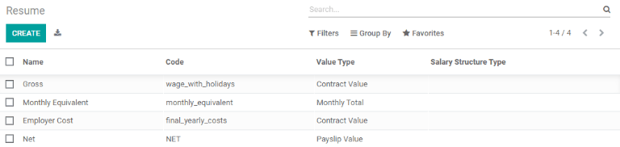

=====================
Payroll configuration
=====================

Odoo *Payroll* is used to process work entries and create payslips for employees, including both
regular pay and commission. Payroll works in conjunction with other Odoo apps, such as *Employees*,
*Timesheets*, *Time Off*, *Attendances*, and *Employees*. Payroll helps ensure there are no issues
or conflicts when validating work entries, handles country-specific localizations to ensure that
payslips follow local rules and taxes, and allows for salary assignments. Payroll configuration is
critical to ensure accurate and timely processing of payslips.

Settings
========

The :guilabel:`Settings` section is where localization settings are configured. Localizations are
country-specific settings pre-configured in Odoo, and account for all taxes, fees, and allowances
for that particular country.  The localization section includes a detailed view of all benefits
provided to employees.

To access the settings, go to :menuselection:`Payroll --> Configuration --> Settings`. Whether or
not payslips should be posted in accounting, or if SEPA payments are created, is selected here.

.. image:: configuration/payroll-settings.png
   :align: center
   :alt: Settings available for payroll.

Any country-specific localizations are set up in the localization section of the settings screen.
All localization items are pre-populated when the country is specified during the creation of the
database. It is not recommended to alter the specific localization settings unless specifically
required.

Work entries
============

Work entry types
----------------

Work entries are specified on timesheets when an employee is logging their time, such as `Sick Time
Off`, `Training`, or `Public Holiday`. Work entries can be configured to account for all types of
work and time off.

When creating a work entry in the *Payroll* application, or when an employee enters information in
the *Timesheets* application, a work entry type needs to be selected. This list of work entry types
is automatically created based off the localization settings set in the database.

Work entry types all have a code to aid in the creation of payslips, and ensure all taxes and fees
are correctly entered.

Go to :menuselection:`Payroll --> Configuration --> Work Entry Types` to view the current work entry
types available.

.. image:: configuration/work-entry-types.png
   :align: center
   :alt: List of all work entry types currently available.

New work entry type
~~~~~~~~~~~~~~~~~~~

To create a new :guilabel:`Work Entry Type`, click the :guilabel:`Create` button. Enter the
information on the form:

- :guilabel:`Work Entry Type Name`: The name should be short descriptive, such as `Sick Time` or
  `Public Holiday`.

- :guilabel:`Code`: This code appears with the work entry type on timesheets and payslips. Since
  the code is used in conjunction with the *Accounting* application, it is advised to check with
  the accounting department for a code to use.

- :guilabel:`Sequence`: The sequence determines the order the work entry is be computed in the
  payslip list.

- Check Off Boxes: If any of the items in the list applies to the work entry, check off
  the box by clicking it. If :guilabel:`Time Off` is checked off, a :guilabel:`Time Off Type` field
  appears. This field has a drop-down menu to select the specific type of time off, or a new type of time
  off can be entered.

.. image:: configuration/new-work-entry.png
   :align: center
   :alt: New work entry type box.

- **Rounding:**

  - **No Rounding:** A time sheet entry is not modified.
  - **Half Day:** A time sheet entry is rounded to the closest half day amount.
  - **Day:**  A time sheet entry is rounded to the closest full day amount.

.. example::
   If an employee enters a time of 5.5 hours on a timesheet, and :guilabel:`Rounding` is set to
   :guilabel:`No Rounding`, the entry remains 5.5 hours. If :guilabel:`Rounding` is set to
   :guilabel:`Half Day`, the entry is changed to 4 hours. If it is set to :guilabel:`Day`, it is
   changed to 8 hours.

Working times
-------------

To view the currently configured working times, go to :menuselection:`Payroll --> Configuration -->
Working Times`. The working times that are available for an employee's contracts and work entries,
are found in this list.

:guilabel:`Working Times` are company-specific. Each company must identify each type of working time
they will used. For example, an Odoo database containing multiple companies that use a standard
40-hour work week needs to have an entry for each company that uses the 40-hour standard work week.

.. image:: configuration/working-times.png
   :align: center
   :alt: All working times currently set up in the database.

New working time
~~~~~~~~~~~~~~~~

To create a new :guilabel:`Working Time`, click the :guilabel:`Create` button. Enter the information
on the form.

.. image:: configuration/new-working-times.png
   :align: center
   :alt: New working type box.

The fields are auto-populated for a regular 40-hour work week but can be modified. First, change the
name of the working time by modifying the text in the name field. Next, make any adjustments to the
days and times the new specific working time applies to.

Modify the :guilabel:`Day of Week`, :guilabel:`Day Period`, and :guilabel:`Work Entry Type`
selections by clicking on the drop-down menu for each field and making the desired selection. The
:guilabel:`Work From` and :guilabel:`Work To` fields are modified by typing in the time.

.. note::
   The time must be in a 24-hour format. For example, `2:00 PM` would be entered as `14:00`.

If the working time should be in a two-week configuration, click the :guilabel:`Switch To 2 Week
Calendar` button. This creates entries for an *even week* and an *odd week*.

Salary
======

.. _payroll/structure-types:

Structure types
---------------

In Odoo, an employee's payslip is based off of a few different
settings and configurations. *Structures* and *Structure Types* are linked, and both affect how an
employee enters timesheets. Each *structure* has specified *structure types* defined on it.
*Structure Types* define how often an employee gets paid, the working hours, and if wages are based
off of a salary (fixed) or how many hours the employee worked (varied).

The different structure types can be seen by going to :menuselection:`Payroll --> Configuration -->
Structure Types`.

There are two default structure types configured in Odoo: *Employee* and *Worker*. Typically,
*Employee* is used for salaried employees, which is why the wage type is *Monthly Fixed Wage*,
and *Worker* is typically used for employees paid by the hour, so the  wage type is *Hourly*.

.. image:: configuration/structure-type.png
   :align: center
   :alt: List of all structure types.

Click the :guilabel:`Create` button to mae a new structure types. Most fields are pre-populated, but
all fields can be edited. Once the fields are edited, click the :guilabel:`Save` button to save the
changes, or click :guilabel:`Discard` to delete the entry.

.. image:: configuration/new-structure.png
   :align: center
   :alt: New structure type box.

Structures
----------

:guilabel:`Salary Structures` are the individual ways an employee gets paid, and are defined by
various rules. Each :ref:`payroll/structure-types` lists all the *structures* available for that particular
structure type.

The amount of structures a company needs depends on how many different kinds of employees are
working, and how different their pay is calculated. For example, a common structure that could be
useful to add may be a **contract** worker, or an **intern**.

To view all the various structures for each structure type, go to :menuselection:`Payroll -->
Configuration --> Structures`.

.. image:: configuration/salary-structure.png
   :align: center
   :alt: All available salary structures.

Each structure lists the various *Structure Types* associated with that specific structure. Each
record listed for a structure is a specific rule for that particular structure.

The default structures for the Employee are *Regular Pay*, and *13th month - End of the year
bonus*. Each specific structure lists how many rules that structure has. For example, *Regular Pay*
has 11 rules. These rules are what calculate the payslip for the employee.

.. image:: configuration/structure-regular-pay-rules.png
   :align: center
   :alt: Salary structure details for Regular Pay.

Rules
-----

Each structure type has a set of rules to follow for accounting purposes. These rules are configured
by the localization, and affect the *Accounting* application, so modifications to the default rules,
or the creation of new rules, should only be done when necessary.

To view all the rules, go to :menuselection:`Payroll --> Configuration --> Rules`. Click on the
drop-down arrow next to a listed structure (such as :guilabel:`Regular Pay`) to view all the rules
for that specific structure.

.. image:: configuration/rules.png
   :align: center
   :alt: Rules for each salary structure type.

Rule parameters
---------------

Salary *rule parameters* affect the various rules for salary configuration. New rule parameters are
not recommended to create unless specifically needed by the accounting department. To access the
parameters, go to :menuselection:`Payroll --> Configuration --> Rule Parameters`.

Other input types
-----------------

When creating payslips, it is sometimes necessary to add other entries for specific circumstances,
like expenses, reimbursements, or deductions. These other inputs can be seen by going to
:menuselection:`Payroll --> Configuration --> Other Input Types`.

.. image:: configuration/other-input.png
   :align: center
   :alt: Other input types for payroll.

To create a new *Input Type*, click the :guilabel:`Create` button. Enter the
:guilabel:`description`, the :guilabel:`code`, and which structure type it applies to. Click the
:guilabel:`Save` button to save the changes, or click :guilabel:`Discard` to delete the entry.

.. image:: configuration/input-type-new.png
   :align: center
   :alt: Create a new Input Type.

Salary package configurator
===========================

The various sections under the :guilabel:`Salary Package Configurator` section all affect an
employee's potential salary. These sections specify what can be offered to an employee, and
depending on what information an employee enters, their salary is adjusted accordingly (such as
deductions, dependents, etc.). When an applicant applies for a job on the company website, the
sections under Salary Package Configurator directly affect what the applicant sees, and what is
populated as the applicant enters information.

Advantages
----------

When offering potential employees a position, there can be certain advantages set in Odoo to make
the offer more appealing other than the salary, such as extra time off, access to a company car,
reimbursement for a phone or internet, etc. Any specific advantage is listed in the
:guilabel:`Advantages` section of the configuration menu. To see the advantages, go to
:menuselection:`Payroll --> Configuration --> Advantages`.

.. image:: configuration/advantages.png
   :align: center
   :alt: Settings available for payroll.

To make a new advantage, click the :guilabel:`Create` button. Enter the information in the fields,
then click the :guilabel:`Save` button to save the changes, or click :guilabel:`Discard` to delete
the entry.

.. image:: configuration/new-advantage.png
   :align: center
   :alt: List of advantages employee's can have.

Personal info
-------------

Every employee in Odoo has an `employee card` that includes all of their personal information,
resume, work information, and documents.

.. note::
   An employee card can be thought of as an employee file.

The *Personal Information* section lists all of the fields that are available to enter on the
employee's card. To access this section, go to :menuselection:`Payroll --> Configuration -->
Personal Information`.

.. image:: configuration/personal-info.png
   :align: center
   :alt: Personal information that appear on employee cards to enter.

To edit an entry, click on the line. Then, click the :guilabel:`Edit` button, and modify the entry.
When done, click :guilabel:`Save` or :guilabel:`Discard` to save the information or cancel the
edits.

To create a new entry, click :guilabel:`Create`. A box appears with all the fields to enter.

.. image:: configuration/personal-new.png
   :align: center
   :alt: New personal information entry.

The two most important fields are :guilabel:`Is Required` and :guilabel:`Display Type`. Checking
the :guilabel:`Is Required` box will make the field mandatory on the employee's card.

The :guilabel:`Display Type` drop-down menu allows for the information to be entered in a variety of
ways, from a text box, a customizable radio button, a check box, a document, and more.

Once the information is entered, click the :guilabel:`Save` button to save the entry.

Resume
------

Click on :menuselection:`Payroll --> Configuration --> Resume` to view the list of items that are
pulled from online job applications housed in the resume section. These fields are populated when a
localization is selected. The default items are gross, monthly equivalent, employer cost, and net.

There should be no need to modify these as it will affect payroll an accounting, but edits can be
made. Click on an individual entry to see the details for the entry. Click :guilabel:`Edit` to make
changes, then click :guilabel:`Save`. To create a new entry, click :guilabel:`Create` and enter the
information, then click :guilabel:`Save`.
