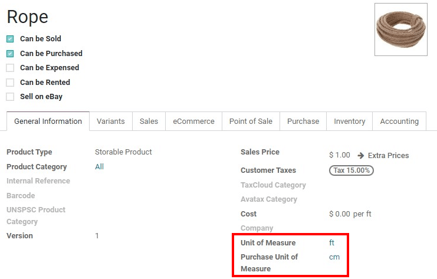
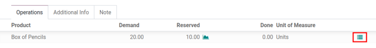

==========================================
Units of measure, packages, and packagings
==========================================

In Odoo, there are a variety of ways to specify the amount of products being bought, stocked, and
sold. *Units of measure*, *packages*, and *packagings* are all available to streamline inventory
flows, allowing for a variety of configurations for products as they enter and leave the warehouse.

Units of measure
================

*Units of measure (UoM)* refers to different measurable quantities used to handle products, such as
units, weight, time, size, etc. For example, different :abbr:`UoMs (Units of Measure)` for weight
can be kilos, pounds, ounces, grams, etc.

In Odoo, stock is easily managed and products are more efficiently purchased from suppliers by
specifying different :abbr:`UoM (Units of Measure)` for both purchasing and selling.

Once a product has a default :guilabel:`Unit of Measure` and :guilabel:`Purchase Unit of Measure` set on the product form,
Odoo automatically converts the different units in the product's purchase/sales orders and the
orders' respective delivery orders/receipts.

The only condition is that all of the units have to be in the *same category* (unit, weight, volume,
length, etc.).

.. example::
   The product, `Rope` has its :guilabel:`Unit of Measure` field set to feet (ft) and its
   :guilabel:`Purchase UoM` set to centimeters (cm). When creating a :abbr:`PO (Purchase Order)`
   for the product, the Purchase :abbr:`UoM (Unit of Measure)`, centimeters, appears on the form to
   measure the quantity of rope the company buys from the vendor.

   .. image:: usage/purchase-rope-in-cm.png
      :align: center
      :alt: Display purchase order for the product, rope, in centimeters.

   Then, when the :abbr:`PO (Purchase Order)` is confirmed, Odoo automatically generates a receipt
   and converts the 10 centimeters to 16.4 feet. On the receipt, the quantity in feet is listed
   under the :guilabel:`Demand` column. Lastly, once the product is received, the quantity in
   :guilabel:`Done` matches the :guilabel:`Demand` column.

   .. image:: usage/receive-rope-in-ft.png
      :align: center
      :alt: Warehouse reception of rope in ft

.. seealso::
   :ref:`Unit of measure<inventory/units_of_measure>`

Packages
========

Packages are a physical container that holds one or several products from a picking, typically used
for outgoing deliveries or internal transfers. Packages can be a reusable or disposable (shipping)
box, and are **not** specific to a product.

Reusable boxes temporarily hold products during a picking to be brought to either a packing or
shipping area. Disposable boxes are the actual shipping containers (cardboard boxes, envelopes,
shipping bags, etc.) that will be used to ship the products out to customers.

Multiple items in a sales order can be separated into different packages to accommodate the
products. For example, a sales order that has 20 boxes of pencils and 4 boxes of erasers can be
separated into two separate packages, each containing 10 boxes of pencils and 2 boxes of erasers.

.. note::
   The products do *not* have to be divided equally. Products can be divided into as many packages
   that are needed to accommodate the sales order.

In Odoo, the quantity of products in each package needs to be recorded, so there is a full history
for each product, including which package each item is shipped out in.

To use this method, ensure the :guilabel:`Packages` option is enabled, by navigating to
:menuselection:`Inventory app --> Configuration --> Settings --> Operations`. Check the box beside
:guilabel:`Packages`, and click :guilabel:`Save` to activate the feature.

On a delivery order, assign which package to use by clicking on the :guilabel:`( ≣ ) Detailed
Operations` icon to the right of each product in the :guilabel:`Operations` tab.

Clicking the :guilabel:`( ≣ ) Detailed Operations` icon of a product reveals a pop-up window. In
this window, the :guilabel:`Product` name, :guilabel:`Demand`, and :guilabel:`Quantity Done` are
clearly displayed above the customizable product line.

Here, the warehouse location the product is coming from can be modified, in addition to the
:guilabel:`Source Package` and :guilabel:`Destination Package`, which represents what package(s) the
product(s) will go into.

Click :guilabel:`Add a line` to include each additional used. Enter the desired amount in the
:guilabel:`Done` field to specify the amount of products to package in the :guilabel:`Destination
Package`.

Use multiple packages in a single delivery
------------------------------------------

Although a delivery order is typically associated with a single package, orders can also be split by
clicking the :guilabel:`( ≣ ) Detailed Operations` icon. It is found to the right of the products
on a :abbr:`SO (Sales Order)`. Clicking the icon opens a the :guilabel:`Detailed
Operations` window-- which contains an editable table where products intended for a particular
package is specified.

.. example::
   To package 10 boxes of pencils with 2 boxes of erasers from the same :abbr:`SO (Sales Order)`,
   select the :guilabel:`( ≣ ) Detailed Operations` icon to the right of `Box of Pencils`. This
   opens a window that is used to detail how products, like the 20 `Box of Pencils`, are packaged.

    Fill in `10` under the :guilabel:`Done` field to package 10 products into the
    :guilabel:`Destination Package`. Start typing under this field and select the :guilabel:`Create`
    button to create a new package, `PACK0000006`. Click :guilabel:`Add a line` to assign the
    remaining products in another package, `PACK0000007`.

    .. image:: usage/packages-detailed-14-15.png
    :align: center
    :alt: Detailed operations where the amount of product going in a pack can be specified.

    Select :guilabel:`Detailed Operations` on the product line for `Box of Erasers` and similarly
    set 2 :guilabel:`Done` products to `PACK0000006` and `PACK0000007` each.

    .. image:: usage/packages-14-15-out.png
    :align: center
    :alt: Put in pack once the done amount matches the demand.

Once all the products for each line have been entered, click :guilabel:`Confirm` to return to the
:abbr:`DO (Delivery Order)`.

The :guilabel:`Done` quantity on the delivery order updates to show the products selected in the
various packages. When the :guilabel:`Done` amount matches the :guilabel:`Demand` amount, click the
:guilabel:`Put In Pack` button in the bottom-left of the delivery order form. And finally, click the
:guilabel:`Validate` button to validate the delivery order.

.. tip::
   The :guilabel:`Put In Pack` button is intended to quickly package all products in the :abbr:`DO
   (Delivery Order)` into 1 new package. The option to rename the package, or modify its contents,
   are available in the :guilabel:`Detailed Operations` pop-up.

Clicking on the :guilabel:`Packages` smart button in the upper-right of the delivery order reveals
a separate page, showing all the packages used in that delivery order.

Packagings
==========

*Packaging* is product specific, and refers to a disposable container that holds several units of a
specific product. Unlike packages, packagings cannot be reusable, and each specific packaging must
be defined on the individual product form.

For example, different packages for cans of soda can be configured as a 6-pack, a 12-pack, or a case
of 36. Each flavor of soda would need a `6`, `12`, and `36` can packaging configured on the individual
product since packagings are product specific, not generic.

Create different packaging for a product
----------------------------------------

To use packagings, ensure the :guilabel:`Product Packagings` feature is enabled. To do that,
navigate to :menuselection:`Inventory app --> Configuration --> Settings --> Products section`.
Then, check the box next to :guilabel:`Product Packagings`, and click :guilabel:`Save`.

In Odoo, product packagings are used on sales/purchase orders and inventory transfers.

Next, to create packagings, navigate to :menuselection:`Inventory app -->
Products --> Products` and click on the :menuselection:`desired product`, then click :guilabel:`Edit` on the product page.

Under the :guilabel:`Inventory` tab, scroll down to the :guilabel:`Packaging` section, and click
:guilabel:`Add a line`. Then, a pop-up window appears, in which the following information for each
packaging should be entered.

- :guilabel:`Packaging`: Name of packaging that appears on sales/purchase orders as a packaging
  option for the product.
- :guilabel:`Contained quantity`: Amount of product in the packaging.
- :guilabel:`Barcode`: Identifier used with the :menuselection:`Barcode` app to trace the packaging
     during stock moves or pickings. Leave blank if not in use.
- :guilabel:`Company`: Indicates the packaging is only available at the selected company. Leave
  blank to make the packaging available across all companies.

.. example::
   Create a packaging type for 6 cans of the product, `Grape Soda`, by naming the
   :guilabel:`Packaging` to 6-pack and setting the :guilabel:`Contained quantity` to 6 in the pop-up
   window that appears after clicking on :guilabel:`Add a line`.

   .. image:: usage/create-product-packages.png
      :align: center
      :alt: Create 6-pack case for product.

When all the necessary information has been entered, either click :guilabel:`Save & Close` to save
the packaging and return to the product detail form, or :guilabel:`Save & New` to save the packaging
and create another one in a fresh pop-up window.

.. example::
   View all the product packagings in the :guilabel:`Inventory` tab of the product form.

    .. image:: usage/grape-soda-14.png
    :align: center
    :alt: Packaging specified on the product page form inventory tab.

View all packagings
-------------------

To view all packagings that have been created, go to :menuselection:`Inventory app --> Configuration
--> Product Packagings`. Doing so reveals a separate page with a complete list of all packagings
that have been created for all products. On this page, create new packagings by clicking
:guilabel:`Create`.

.. example::
   After navigating to the :guilabel:`Product Packagings` page, packagings for two different kinds
   of sodas is displayed. Each soda type is configured with three types of packagings.

    .. image:: usage/packagings-14.png
    :align: center
    :alt: List of different packagings for products.

Then, when creating a sales order in the :menuselection:`Sales` app, specify the packagings that
should be used for the product(s). The chosen packaging is displayed on the :abbr:`SO (Sales Order)`
under the :guilabel:`Package` field.

.. example::
   18 cans of the product, `Grape Soda`, is packed using three 6-pack packagings.

    .. image:: usage/packagings-sales-order-14.png
    :align: center
    :alt: Sales order showing the packages being used.

.. tip::
   Packaging is also useful during product procurement at the reception level when used in
   conjunction with Odoo :ref:`Barcode <inventory/barcode/setup/software>`. When scanning the
   barcode of the packaging, Odoo automatically adds the number of units contained in the packing on
   the picking.

