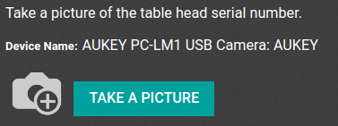

================
Connect a camera
================

A camera can be connected to the :abbr:`IoT (Internet of Things)` box with an Odoo database. It can
be added in a few easy steps. Then, it can be used in a manufacturing process or it can be linked to
a quality control point/quality check. Doing so will allow for the taking of pictures when a chosen
quality control point/check has been reached or when a specific key is pressed during manufacturing.

Connection
==========

To connect the camera to the :abbr:`IoT (Internet of Things)` box, simply connect the two by cable.
This is likely a :abbr:`USB (Universal Serial Bus)` cable.

If the camera is `supported <https://www.odoo.com/page/iot-hardware>`_, there is no need to set up
anything as it will be detected as soon as it is connected.

.. image:: camera/camera-dropdown.png
   :align: center
   :alt: Camera recognized on the IoT box.

Link a camera to a quality control point within a manufacturing process
=======================================================================

In the :menuselection:`Quality` app, a device can be set up on a :guilabel:`Quality Control Point`.
Go to the :menuselection:`Quality Control --> Control Points` and open the :guilabel:`Control Point`
which will be linked with the camera.

Now, edit the :guilabel:`Control Point` by selecting the :guilabel:`Type` field and clicking on
:guilabel:`Take a Picture` from the dropdown. A field called :guilabel:`Device` will appear where
the attached *device* can be selected. :guilabel:`Save` the changes if required.

.. image:: camera/control-point-device.png
   :align: center
   :alt: Setting up the device on the quality control point.

The camera can be used with the selected :guilabel:`Quality Control Point`. When the
:guilabel:`Quality Control Point` is reached during the manufacturing process, the database will
prompt the operator to take a picture.

.. seealso::
   In a *Quality Check* the :guilabel:`Type` of check can also be specified to :guilabel:`Take a
   Picture`. Access *Quality Checks* by navigating to :menuselection:`Quality app --> Quality
   Control --> Quality Checks --> New`.

.. seealso::
   - :doc:`../../../inventory_and_mrp/manufacturing/quality_control/quality_control_points`
   - :doc:`../../../inventory_and_mrp/manufacturing/quality_control/quality_alerts`

Link a camera to a work center in the manufacturing app
=======================================================

To link the camera to an action, it needs to be configured on a work center. Navigate to
:menuselection:`Manufacturing --> Configuration --> Work Centers`. Go to the :guilabel:`Work Center`
the camera will be used in and add the device in the :guilabel:`IoT Triggers` tab under
:guilabel:`Device` by selecting :guilabel:`Add a Line`. Then, it can be linked to the
:guilabel:`Action` labeled :guilabel:`Take a Picture`. A key can be added to trigger the action.

It should be noted that the trigger that is first in the list will be chosen first. So, the order
matters and these triggers can be dragged into order.

.. note::
   On the :guilabel:`work order` screen, a status graphic indicates whether the database is
   correctly connected to the camera.

.. seealso::
   :ref:`workcenter_iot`
