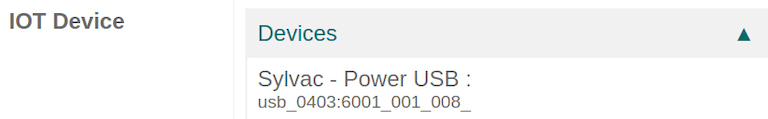

==========================
Connect a measurement tool
==========================

With Odoo's :abbr:`IoT (Internet of Things)` box, it is possible to connect measurement tools to the
Odoo database for use in the :menuselection:`Quality app` on a :guilabel:`Quality Control Point` /
:guilabel:`Quality Check` or for use in a :guilabel:`Work Center` during the manufacturing process.

Find the list of supported devices here: `Supported devices
<https://www.odoo.com/page/iot-hardware>`_.

Connect with Universal Serial Bus (USB)
=======================================

To add a device connected by :abbr:`USB (Universal Serial Bus)`, just plug the :abbr:`USB (Universal
Serial Bus)` cable into the :abbr:`IoT (Internet of Things)` box, and the device should appear in
the Odoo database.

Connect with Bluetooth
======================

Activate the Bluetooth on the device (see the device manual for further explanation) and the
:abbr:`IoT (Internet of Things)` box will automatically try to connect to the device.

Here is an example of what it should look like:

.. image:: measurement_tool/measurement-tool.jpeg
   :align: center
   :alt: Bluetooth indicator on measurement tool.

Link a measurement tool to a quality control point within a manufacturing process
=================================================================================

In the :menuselection:`Quality` app, a device can be set up on a :guilabel:`Quality Control Point`.
Go to the :menuselection:`Quality Control --> Control Points` and open the :guilabel:`Control Point`
which will be linked with the measurement tool.

Now, edit the :guilabel:`Control Point`, select the :guilabel:`Type` field and click on
:guilabel:`Measure` from the dropdown. A field called :guilabel:`Device` will appear where the
attached *device* can be selected. Additionally, :guilabel:`Norm` and :guilabel:`Tolerance` can be
configured. :guilabel:`Save` the changes if required.

Now, the measurement tool is linked to the chosen :guilabel:`Quality Control Point`. The value,
which usually needs to be changed manually, will be automatically updated while the tool is being
used.

.. image:: measurement_tool/measurement-control-point.png
   :align: center
   :alt: Measurement tool input in the Odoo database.

.. seealso::
   In a *Quality Check* the :guilabel:`Type` of check can also be specified to :guilabel:`Measure`.
   Access *Quality Checks* by navigating to :menuselection:`Quality app --> Quality Control -->
   Quality Checks --> New`.

.. seealso::
   - :doc:`../../../inventory_and_mrp/manufacturing/quality_control/quality_control_points`
   - :doc:`../../../inventory_and_mrp/manufacturing/quality_control/quality_alerts`

Link a measurement tool to a work center in the manufacturing app
=================================================================

To link the measurement tool to an action, it needs to be configured on a work center. Navigate to
:menuselection:`Manufacturing --> Configuration --> Work Centers`. Go to the :guilabel:`Work Center`
the measurement tool will be used in and add the device in the :guilabel:`IoT Triggers` tab under
:guilabel:`Device` by selecting :guilabel:`Add a Line`. Then, it can be linked to the
:guilabel:`Action` labeled :guilabel:`Take Measure`. A key can be added to trigger the action.

It should be noted that the trigger that is first in the list will be chosen first. So, the order
matters and these triggers can be dragged into order.

.. note::
   On the :guilabel:`work order` screen, a status graphic indicates whether the database is
   correctly connected to the measurement tool.

.. seealso::
   :ref:`workcenter_iot`
