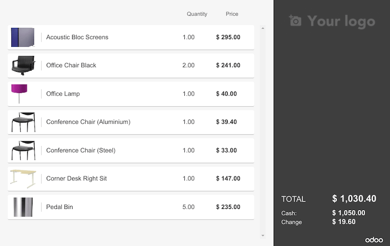
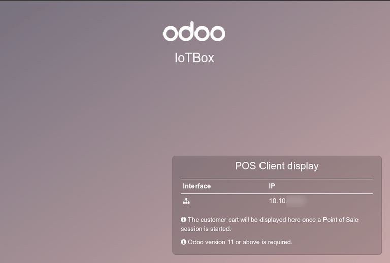

================
Connect a screen
================

In Odoo, an :abbr:`IoT (Internet of Things)` box can be connected to a screen display. After being
configured, the screen can be used to display a :abbr:`PoS (Point of Sale)` order to a client.

.. note::
   Access the customer display from any other computer by going to the :abbr:`IoT (Internet of
   Things)` box homepage and clicking on the :guilabel:`POS Display` button. Access the :abbr:`IoT
   (Internet of Things)` box homepage by navigating to :menuselection:`IoT app --> IoT Boxes` and
   click on the :abbr:`IP (Internet Protocol)` or :abbr:`URL (Uniform Resource Locators)`.

Connection
==========

The way to connect the screen display to the :abbr:`IoT (Internet of Things)` box differs depending
on the model.

.. tabs::

   .. tab:: IoT Box model 4

      Connect up to two screens with Micro-HDMI cables on the side of the :abbr:`IoT (Internet of
      Things)` box. If two screens are connected, they can display distinct content (see usage
      below).

   .. tab:: IoT Box model 3

      Connect the screen with an HDMI cable on the side of the :abbr:`IoT (Internet of Things)` box.

.. important::
   Screen(s) should be connected before the :abbr:`IoT (Internet of Things)` Box is switched on. If
   it is already on, connect the screen(s), and then restart the :abbr:`IoT (Internet of Things)`
   Box by unplugging it and plugging it back into its power source.

.. warning::
   The usage of HDMI/Micro-HDMI adapters may cause issues which will result in a blank, black screen
   on the screen display. Cable usage is recommended.

If the connection was successful, the screen should display the :guilabel:`POS Client display`
screen.

         connected to an IoT box.

The screen should also appear in the list of :guilabel:`Displays` on the :abbr:`IoT (Internet of
Things)` box home page. Alternatively the display can also be seen by accessing :menuselection:`IoT
app --> Devices`.

.. image:: screen/screen-screen-name-example.png
   :align: center
   :alt: An example of a screen display name shown on the IoT box home page.

.. note::
   If no screen is detected, a default display named :guilabel:`Distant Display` will be used
   instead.

    .. image:: screen/screen-no-screen.png
       :align: center
       :alt: The "Distant Display" screen name will be used if no screen is detected.

Usage
=====

Show Point of Sale orders to customers
--------------------------------------

To use the screen in the :menuselection:`Point of Sale` app, go to :menuselection:`Point of Sale -->
Configuration --> Point of Sale`, open the desired screen, :guilabel:`Edit`, and enable the
:guilabel:`IoT Box Devices` feature.

Now, select :guilabel:`IoT Box` in the drop-down menu and choose the screen in the
:guilabel:`Customer Display` option. Then, :guilabel:`Save` if required.

.. image:: screen/screen-pos-screen-config.png
   :align: center
   :alt: Connect the screen display to the Point of Sale app.

The screen is now available for :abbr:`PoS (Point of Sale)` sessions. A :guilabel:`Screen` icon will
appear in the menu at the top of the screen to inform the connection status with the screen.

.. image:: screen/screen-pos-icon.png
   :align: center
   :alt: The "screen" icon on the Point of Sale display shows the connection status with the
         screen.

The screen will automatically show the :abbr:`PoS (Point of Sale)` orders and update when changes
are performed on the order.

Display a website
-----------------

Opening the screen form view at :menuselection:`IoT app --> Devices --> (screen device)` allows the
user to choose a particular website URL to display on the screen with the :guilabel:`Display URL`
field.
